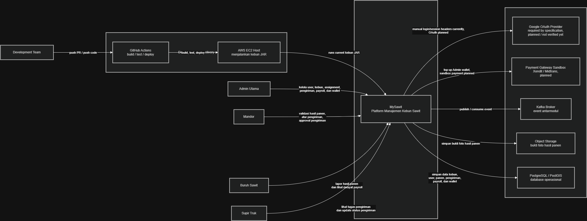
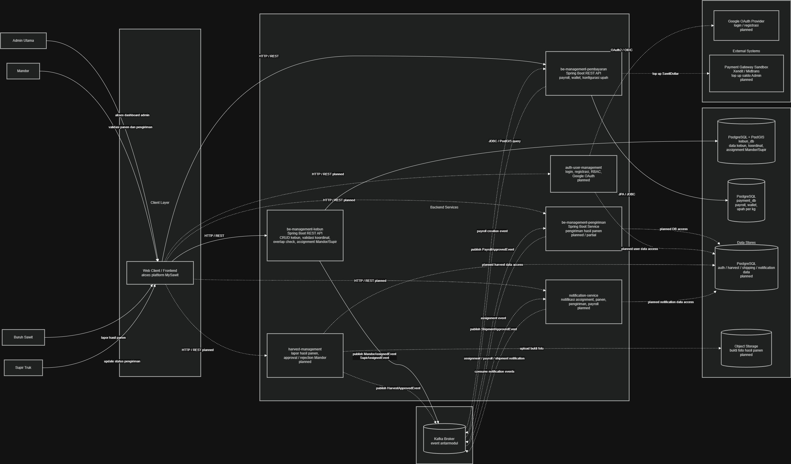
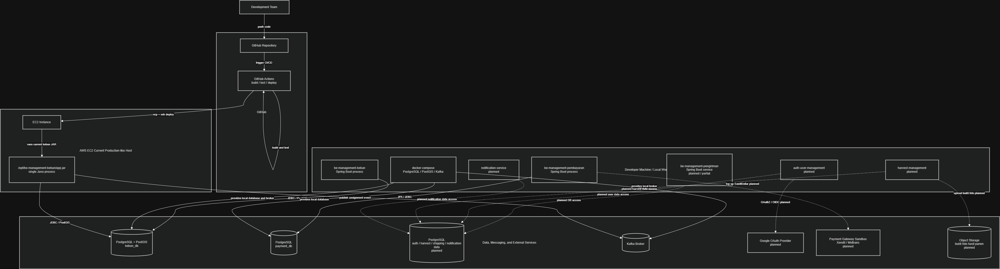
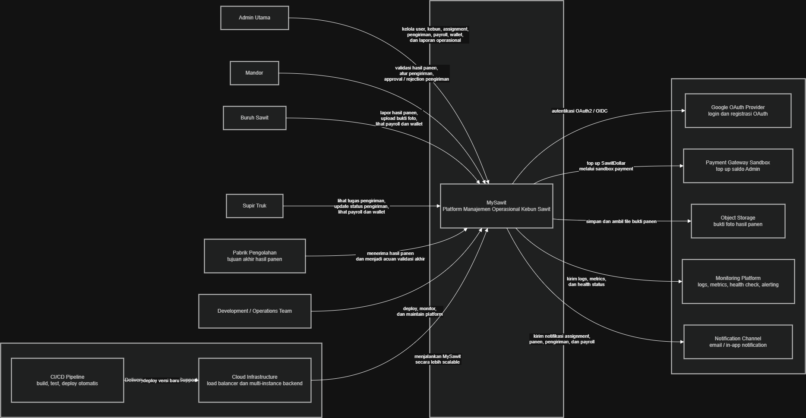
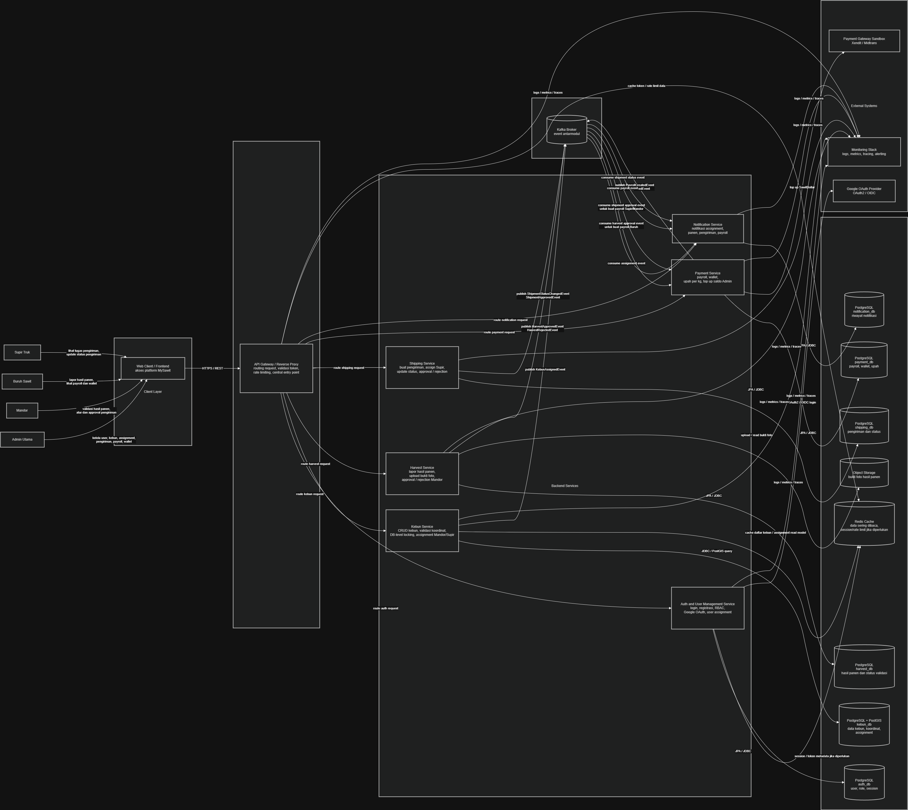
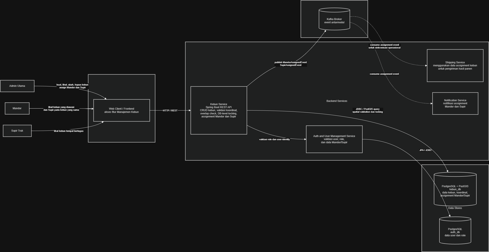
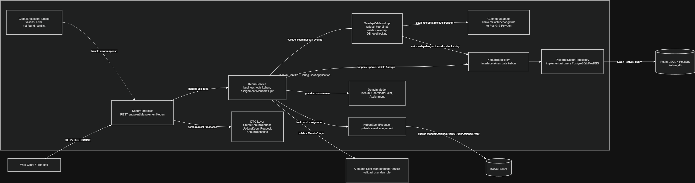
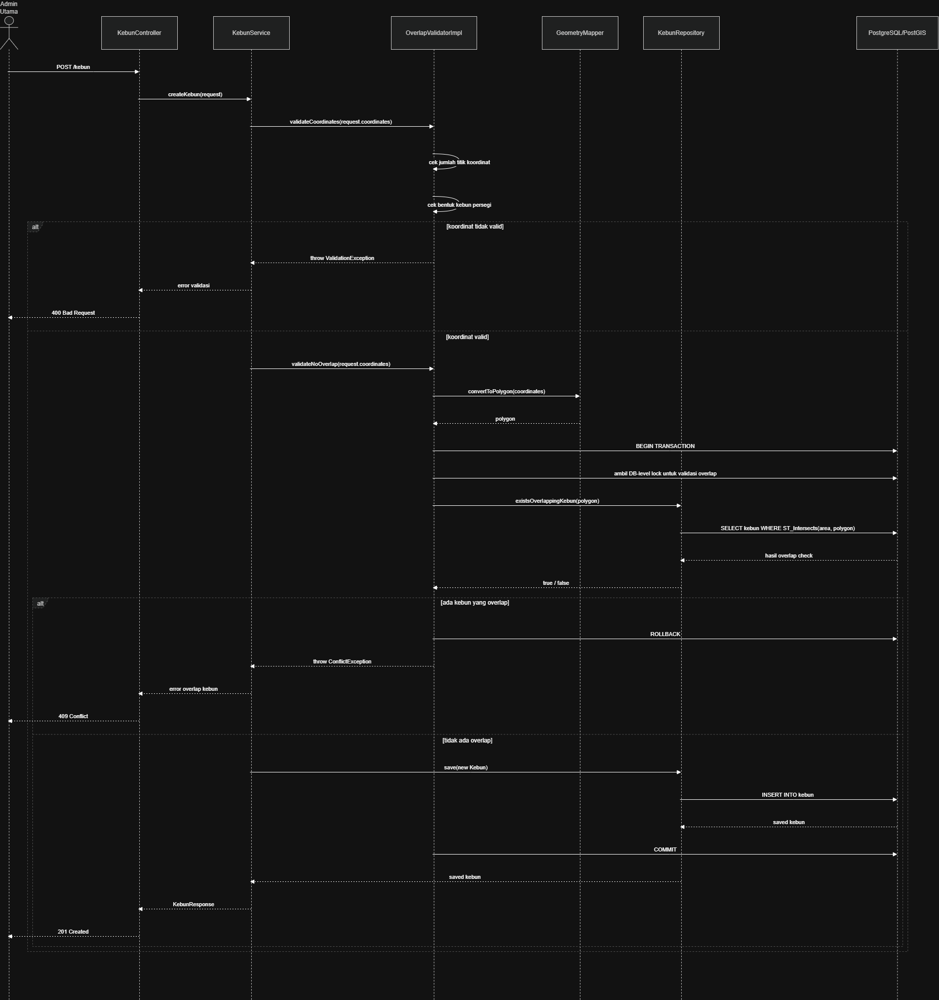
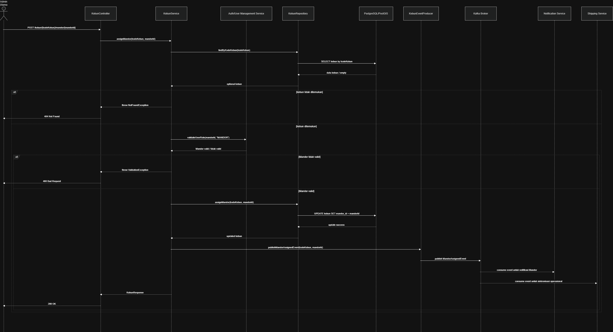
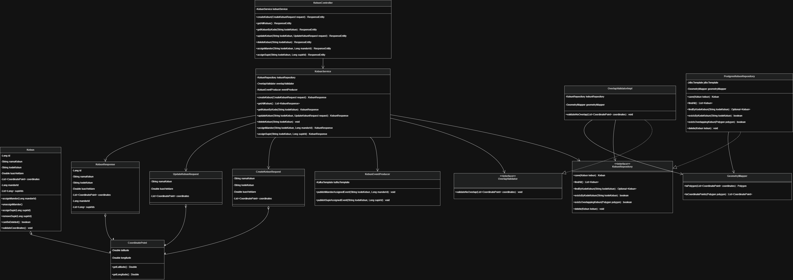

# MySawit Architecture Documentation

# 1. Current Architecture of MySawit

## 1.1 Current System Context Diagram

Current context diagram menjelaskan posisi MySawit sebagai sistem utama yang berinteraksi dengan para pengguna dan external system. Admin Utama memiliki akses paling luas untuk mengelola user, kebun, assignment, payroll, dan proses operasional lain. Mandor berperan dalam supervisi hasil panen dan pengiriman. Buruh Sawit mencatat hasil panen. Supir Truk menjalankan pengiriman hasil panen ke pabrik.

## 1.2 Current Container Diagram

Current container diagram menunjukkan bahwa sistem sudah mulai dipisahkan berdasarkan domain. Modul kebun bertanggung jawab terhadap data kebun dan assignment. Modul pembayaran menangani payroll dan wallet. Modul pengiriman menangani proses pengangkutan hasil panen. PostgreSQL/PostGIS digunakan untuk menyimpan data kebun dan melakukan operasi spasial seperti validasi overlap kebun.

Kafka digunakan sebagai event broker supaya service dapat berkomunikasi secara asynchronous. Contohnya, ketika Mandor ditugaskan ke kebun, service kebun dapat menerbitkan event yang nantinya dapat digunakan oleh service lain seperti notification atau operation service.

## 1.3 Current Deployment Diagram

Current deployment diagram menunjukkan bahwa sistem masih berada pada tahap awal deployment. Backend Spring Boot dapat berjalan sebagai single Java process di server. Database PostgreSQL/PostGIS dan Kafka dapat dijalankan melalui Docker atau service terpisah.

Deployment seperti ini masih cukup untuk pengembangan awal. Namun, pendekatan single instance memiliki risiko availability karena jika satu server atau satu process bermasalah, sistem bisa ikut tidak dapat diakses.

## 1.4 Current Architecture Decisions and Trade-offs

Beberapa keputusan arsitektur saat ini adalah:

1. Menggunakan Spring Boot untuk backend service.
2. Menggunakan PostgreSQL/PostGIS untuk data kebun dan validasi spasial.
3. Menggunakan Kafka untuk komunikasi event-driven.
4. Memisahkan beberapa domain menjadi service berbeda seperti kebun, pembayaran, dan pengiriman.
5. Menggunakan DB-level locking pada validasi overlap kebun agar data kebun tetap konsisten saat ada request bersamaan.

Trade-off dari keputusan ini adalah sistem menjadi lebih siap untuk modularisasi, tetapi setup dan integrasi menjadi lebih kompleks dibanding satu monolithic application sederhana. Penggunaan Kafka juga membantu decoupling, tetapi membutuhkan konfigurasi tambahan dan pemahaman event flow yang lebih jelas.

# 2. Architectural Risk Analysis

## 2.1 Why Risk Storming Was Applied

Risk Storming dipakai karena arsitektur MySawit yang sekarang masih cukup aman untuk skala kecil. Namun, jika MySawit benar-benar digunakan oleh banyak unit kebun, maka masalah yang awalnya kecil bisa menjadi lebih besar.

Beberapa risiko sebenarnya sudah mulai dimitigasi. Contohnya pada modul kebun, validasi overlap tidak hanya mengandalkan pengecekan di level aplikasi, tetapi sudah diperkuat dengan DB-level locking. Ini membuat data kebun lebih aman ketika ada beberapa request yang mencoba membuat atau mengubah data kebun secara bersamaan.

Namun, walaupun satu risiko sudah ditangani, masih ada risiko lain yang perlu diperhatikan. Misalnya autentikasi dan otorisasi, single instance deployment, observability, pembayaran, wallet, backup database, dan komunikasi antarmodul. Dengan Risk Storming, kami mencoba melihat bagian mana yang masih bisa menjadi masalah jika sistem berkembang lebih besar.

## 2.2 Success Scenario

Misalnya MySawit berhasil digunakan oleh banyak kebun sawit milik BurhanSawit. Pengguna aktif tidak lagi hanya beberapa orang, tetapi bisa mencapai ratusan atau ribuan pengguna yang terdiri dari Admin Utama, Mandor, Buruh Sawit, dan Supir Truk.

Pada kondisi itu, aktivitas sistem akan meningkat. Admin sering membuat dan mengubah data kebun, Mandor memvalidasi hasil panen, Supir Truk mengubah status pengiriman, dan sistem pembayaran perlu membuat payroll secara berkala. Database juga akan menyimpan banyak data historis seperti hasil panen, pengiriman, assignment, payroll, dan perubahan saldo wallet.
harus dilakukan dengan sistem yang harus lebih stabil, mudah dipantau, punya backup, dan tidak langsung mati jika satu server atau satu process mengalami error.

## 2.3 Risk Identification

| ID | Area | Risiko | Dampak Utama | Kemungkinan | Dampak | Skor | Mitigasi |
|---|---|---|---|---|---|---|---|
| R1 | Autentikasi dan otorisasi | Role atau identitas user terlalu dipercaya dari request tanpa validasi token yang kuat | Security | High | High | 9 | Gunakan autentikasi terpusat dengan JWT atau OAuth2, lalu validasi token di gateway atau service |
| R2 | Locking kebun | DB-level locking sudah mengurangi race condition overlap, tetapi masih perlu dipastikan tidak menjadi bottleneck saat traffic tinggi | Performance, maintainability | Low | Medium | 2 | Pantau performa query locking, gunakan index spasial yang tepat, dan dokumentasikan transaksi kritis |
| R3 | Deployment single instance | Jika backend hanya berjalan pada satu EC2 atau satu process, sistem bisa down saat server bermasalah | Availability | Medium | High | 6 | Gunakan reverse proxy atau load balancer dengan lebih dari satu instance |
| R4 | Observability belum konsisten | Logging, metrics, dan tracing belum seragam di semua service | Maintainability | High | Medium | 6 | Standarisasi log, metrics, health check, dan dashboard monitoring |
| R5 | Pembayaran dan wallet | Perhitungan payroll dan perubahan saldo harus sangat akurat, kalau tidak bisa menyebabkan data uang salah | Data integrity | Medium | High | 6 | Gunakan tipe data presisi seperti BigDecimal, transaksi yang jelas, idempotency, dan audit log |
| R6 | Modul belum lengkap | Beberapa modul seperti pengiriman, notifikasi, atau auth penuh belum terlihat matang sehingga integrasi bisa terlambat | Maintainability | High | Medium | 6 | Tentukan kontrak API dan event sejak awal, walaupun implementasi belum lengkap |
| R7 | Komunikasi antarmodul | Kalau semua modul saling panggil langsung, sistem akan makin sulit diubah dan rawan coupling | Modifiability | Medium | Medium | 4 | Gunakan event broker untuk proses asynchronous seperti assignment, payroll, dan notifikasi |
| R8 | Backup dan recovery | Belum terlihat strategi backup dan restore database yang jelas | Recoverability | Medium | High | 6 | Buat backup otomatis, aturan retensi, dan prosedur restore |
| R9 | Upload bukti panen | Jika foto hasil panen disimpan langsung di server aplikasi, storage bisa cepat penuh dan sulit dipindahkan | Scalability | Medium | Medium | 4 | Gunakan object storage untuk file bukti panen |
| R10 | Data assignment | Assignment Mandor, Buruh, dan Supir berpengaruh ke banyak modul, sehingga data yang tidak sinkron bisa mengganggu operasi | Consistency | Medium | High | 6 | Gunakan event assignment dan aturan ownership yang jelas antarservice |

## 2.4 Risk Consensus

Dari risiko yang ditemukan, risiko paling penting bukan hanya yang paling banyak terjadi, tetapi yang paling besar dampaknya ke sistem kalau benar-benar terjadi.

Risiko pertama yang paling penting adalah masalah autentikasi dan otorisasi. Karena MySawit punya beberapa role, yaitu Admin Utama, Mandor, Buruh Sawit, dan Supir Truk, kesalahan validasi role bisa membuat user mengakses fitur yang seharusnya tidak boleh diakses.

Risiko kedua adalah ketersediaan sistem. Kalau sistem hanya berjalan di satu server atau satu process, maka ketika server tersebut mati, semua pengguna tidak bisa menggunakan aplikasi. Ini tidak masalah saat demo, tetapi akan bermasalah jika sistem digunakan secara rutin.

Risiko ketiga adalah pembayaran dan wallet. Karena payroll berhubungan dengan saldo dan upah, kesalahan kecil seperti rounding, update ganda, atau transaksi yang tidak konsisten bisa menyebabkan data finansial salah.

Risiko keempat adalah integrasi antarmodul. MySawit memiliki banyak modul yang saling terhubung, seperti kebun, hasil panen, pengiriman, pembayaran, dan notifikasi. Jika komunikasi antarmodul tidak jelas, maka sistem akan sulit dikembangkan oleh banyak anggota kelompok.

Untuk validasi overlap kebun, risiko race condition sudah tidak menjadi risiko utama lagi karena sudah ada DB-level locking. Namun, bagian ini tetap perlu dipantau karena locking yang terlalu berat dapat mempengaruhi performa ketika jumlah request meningkat.

## 2.5 Risk Mitigation

## R1 Autentikasi dan Otorisasi

Perubahan arsitektur yang disarankan adalah menambahkan API Gateway dan autentikasi berbasis JWT atau OAuth2. Dengan ini, setiap request membawa token yang sudah ditandatangani, dan service tidak asal percaya pada role dari header biasa.

Keuntungannya, akses antar role jadi lebih aman dan konsisten. Admin, Mandor, Buruh, dan Supir bisa dibatasi sesuai hak akses masing-masing. Kekurangannya, implementasi menjadi lebih kompleks karena perlu mengatur token, masa berlaku token, refresh token, dan validasi di setiap service.

## R2 Locking Kebun dan Validasi Overlap

Pada versi sebelumnya, validasi overlap kebun dianggap berisiko karena jika ada beberapa instance backend, pengecekan overlap di level aplikasi saja bisa gagal. Risiko ini sekarang sudah berkurang karena sistem sudah menerapkan DB-level locking.

Dengan DB-level locking, operasi yang sensitif terhadap konsistensi data kebun dapat dikontrol langsung di database. Jadi ketika ada request yang mencoba membuat atau mengubah kebun secara bersamaan, database dapat membantu menjaga agar proses validasi dan penyimpanan tidak saling bertabrakan.

Risiko yang tersisa bukan lagi correctness utama, tetapi lebih ke performa dan maintainability. Jika jumlah request bertambah besar, locking yang terlalu luas bisa membuat beberapa request harus menunggu lebih lama. Karena itu, mitigasi lanjutannya adalah memastikan query sudah memakai index yang tepat, terutama untuk data spasial, dan bagian transaksi yang memakai lock harus dibuat sesingkat mungkin.

## R3 Single Instance Deployment

Untuk kondisi awal, menjalankan backend di satu EC2 masih wajar. Namun, kalau project sukses, single instance menjadi risiko besar karena tidak ada cadangan jika server atau process mati.

Mitigasinya adalah menjalankan beberapa instance backend di belakang reverse proxy atau load balancer. Dengan ini, jika satu instance mati, request masih bisa diarahkan ke instance lain. Trade-off-nya adalah deployment menjadi lebih rumit dan membutuhkan konfigurasi tambahan seperti health check, environment variable yang konsisten, dan shared database yang aman.

## R4 Observability

Sistem yang terdiri dari banyak service akan sulit didebug kalau tidak punya observability yang baik. Masalahnya, error bisa terjadi di service kebun, pembayaran, pengiriman, atau event broker, tetapi penyebabnya tidak langsung kelihatan.

Mitigasinya adalah membuat standar logging, metrics, tracing, dan health check untuk semua service. Minimal, setiap service punya endpoint health check dan log yang jelas. Untuk versi lebih baik, bisa digunakan Prometheus, Grafana, dan OpenTelemetry. Trade-off-nya adalah ada tambahan konfigurasi dan resource untuk monitoring.

## R5 Pembayaran dan Wallet

Pembayaran dan wallet harus diperlakukan lebih hati-hati dibanding CRUD biasa. Kalau payroll sudah diterima, saldo user bertambah dan saldo Admin Utama berkurang. Jika operasi ini gagal di tengah atau diproses dua kali, data bisa menjadi tidak konsisten.

Mitigasinya adalah menggunakan tipe data presisi seperti BigDecimal, transaksi database yang jelas, idempotency key, dan audit log. Dengan begitu, sistem bisa mencegah pembayaran ganda dan tetap punya catatan perubahan saldo. Trade-off-nya adalah implementasi payment service menjadi lebih panjang dan perlu testing lebih serius.

## R6 Modul Belum Lengkap

Beberapa modul seperti pengiriman, notifikasi, auth penuh, dan hasil panen mungkin belum semuanya matang. Risiko dari kondisi ini adalah integrasi antar anggota kelompok menjadi tidak jelas, karena setiap modul bisa punya asumsi masing-masing.

Mitigasinya adalah membuat kontrak API dan event sejak awal. Misalnya, service kebun menerbitkan event saat Mandor ditugaskan, lalu notification service atau modul lain cukup consume event tersebut. Dengan ini, walaupun implementasi belum selesai, batas antar modul sudah lebih jelas.

## R7 Komunikasi Antarmodul

Jika semua modul saling memanggil langsung dan membaca database service lain, sistem akan sulit dikembangkan. Perubahan kecil di satu modul bisa merusak modul lain.

Mitigasinya adalah menggunakan komunikasi yang jelas, misalnya REST untuk request yang butuh jawaban langsung dan Kafka/event broker untuk proses asynchronous. Contohnya assignment Mandor atau Supir bisa menghasilkan event, lalu modul notifikasi atau pengiriman dapat bereaksi tanpa harus langsung bergantung ke database kebun.

## R8 Backup dan Recovery

Database menyimpan data penting seperti data kebun, assignment, pengiriman, payroll, dan wallet. Jika database rusak atau hilang tanpa backup, sistem akan sulit dipulihkan.

Mitigasinya adalah membuat backup otomatis dan prosedur restore. Untuk tahap awal, backup harian sudah cukup. Untuk tahap lebih serius, perlu restore drill agar tim tahu apakah backup benar-benar bisa digunakan.

## 2.6 Architecture Modification Justification

Dari hasil Risk Storming, arsitektur masa depan tidak hanya dibuat agar terlihat lebih besar, tetapi untuk menjawab risiko yang memang masih relevan dari arsitektur sekarang.

API Gateway ditambahkan untuk membantu validasi akses dan membuat request masuk lebih terkontrol. Load balancer dan multiple backend instance ditambahkan untuk mengurangi risiko downtime. PostgreSQL/PostGIS tetap digunakan karena cocok untuk data koordinat kebun, dan untuk bagian kebun sudah diperkuat dengan DB-level locking agar operasi overlap-sensitive lebih aman. Kafka digunakan untuk komunikasi asynchronous agar modul seperti kebun, pengiriman, pembayaran, dan notifikasi tidak saling bergantung terlalu kuat.

Selain itu, Redis atau cache bisa digunakan untuk data yang sering dibaca, misalnya daftar kebun atau data assignment, tetapi tidak boleh menjadi sumber kebenaran utama. Object storage juga lebih cocok untuk bukti foto hasil panen daripada menyimpannya langsung di server aplikasi.

# 3. Future Architecture

## 3.1 Future Architecture Goals

Future architecture dibuat untuk menjawab risiko yang muncul dari current architecture. Tujuan utamanya adalah membuat MySawit lebih aman, lebih scalable, lebih mudah dipantau, dan lebih jelas batas antar modulnya.

Pada future architecture, sistem diarahkan untuk memiliki API Gateway, service yang lebih jelas berdasarkan domain, event broker untuk komunikasi asynchronous, object storage untuk file bukti hasil panen, observability stack, dan database yang lebih siap untuk backup serta recovery.

## 3.2 Future System Context Diagram

Future context diagram menunjukkan bahwa MySawit tidak hanya menjadi aplikasi internal sederhana, tetapi menjadi platform operasional yang terhubung dengan identity provider, payment gateway, storage, dan monitoring. Sistem ini perlu menangani lebih banyak pengguna dan proses bisnis yang lebih kritis.

## 3.3 Future Container Diagram

Future container diagram menunjukkan bahwa setiap service memiliki tanggung jawab yang lebih jelas. Auth Service menangani login dan role. Kebun Service menangani data kebun dan assignment. Harvest Service menangani laporan hasil panen. Shipping Service menangani pengiriman. Payment Service menangani payroll dan wallet. Notification Service menangani pesan kepada user.

Kafka digunakan untuk event seperti assignment, harvest approved, shipment approved, payroll created, dan notification requested. Dengan cara ini, setiap service tidak harus langsung membaca database service lain.

## 3.4 How Future Architecture Mitigates Risks

Future architecture membantu mengurangi risiko dengan beberapa cara:

1. API Gateway dan Auth Service mengurangi risiko akses tidak sah.
2. Load balancer dan multiple backend instance mengurangi risiko downtime.
3. Kafka mengurangi coupling antarmodul.
4. Object storage membantu mengelola file bukti hasil panen dengan lebih scalable.
5. Monitoring dan logging membantu debugging ketika sistem mulai besar.
6. Backup database membantu recovery jika terjadi masalah data.
7. DB-level locking tetap digunakan pada modul kebun untuk menjaga konsistensi data spasial.

## 3.5 Future Architecture Trade-offs

Arsitektur future menjadi lebih kompleks. Jumlah service bertambah, deployment lebih sulit, dan observability menjadi lebih penting. Tim juga harus lebih disiplin dalam membuat kontrak API dan event agar service tidak saling bergantung secara sembarangan.

Namun, trade-off ini masuk akal karena MySawit punya banyak alur bisnis yang saling terhubung. Kalau semuanya tetap dibuat terlalu sederhana, sistem akan sulit berkembang ketika jumlah data, user, dan transaksi bertambah.

# 4. Individual: Manajemen Kebun Sawit

Modul ini bertanggung jawab untuk mengelola data kebun yang dimiliki BurhanSawit, termasuk membuat kebun baru, melihat daftar kebun, mengubah data kebun, menghapus kebun, validasi koordinat, validasi overlap, assignment Mandor, dan assignment Supir Truk.

Berdasarkan requirement MySawit, setiap kebun memiliki nama kebun, kode unik kebun, luas dalam hektare, dan empat titik koordinat dalam bentuk latitude dan longitude. Kebun juga harus berbentuk persegi dan tidak boleh overlap dengan kebun lain. Selain itu, Admin Utama dapat menugaskan Mandor dan Supir Truk ke kebun.

Secara arsitektur, modul ini penting karena data kebun menjadi data master yang dipakai oleh modul lain. Mandor dan Supir hanya dapat menjalankan beberapa aksi jika sudah ditempatkan pada kebun tertentu. Karena itu, integritas data kebun dan assignment harus dijaga.

## 4.2 Individual Container Diagram

Container diagram ini memperlihatkan bagaimana Kebun Service berinteraksi dengan pengguna, database, Kafka, dan service lain. Admin Utama menggunakan Kebun Service untuk CRUD kebun dan assignment. Mandor dan Supir menggunakan data assignment untuk mengetahui kebun tempat mereka bekerja.

Kebun Service menggunakan PostgreSQL/PostGIS untuk menyimpan data kebun dan melakukan validasi spasial. Kafka digunakan untuk publish event ketika terjadi assignment, sehingga modul lain seperti Notification atau Shipping dapat bereaksi tanpa harus membaca database Kebun secara langsung.

## 4.3 Individual Component Diagram

Component diagram ini memperlihatkan struktur internal service kebun. KebunController menerima request HTTP. KebunService menjalankan business logic. OverlapValidatorImpl menangani validasi overlap dan koordinat. GeometryMapper mengubah koordinat latitude/longitude menjadi bentuk polygon yang bisa diproses oleh PostGIS. KebunRepository dan PostgresKebunRepository menangani akses database. KafkaTemplate digunakan untuk publish event assignment.

Pemisahan ini penting supaya setiap komponen punya tanggung jawab yang jelas. Controller tidak langsung mengakses database, dan logic validasi tidak dicampur dengan logic HTTP.

## 4.4 Code Diagram 1 - Create Kebun and Overlap Validation

Diagram ini dipilih karena create kebun adalah salah satu flow paling penting dalam modul kebun. Saat Admin membuat kebun, sistem harus memvalidasi bahwa koordinat tidak kosong, jumlah titik sesuai, bentuk kebun valid, dan area kebun tidak overlap dengan kebun lain.

Flow ini juga menunjukkan kenapa PostgreSQL/PostGIS penting. Validasi overlap tidak cukup hanya dilihat sebagai validasi biasa, karena data koordinat harus dicek terhadap data kebun yang sudah ada. Selain itu, karena sekarang sudah ada DB-level locking, flow ini juga lebih aman ketika ada beberapa request yang masuk bersamaan.

## 4.5 Code Diagram 2 - Mandor Assignment Event Flow

Diagram ini dipilih karena assignment Mandor adalah bagian penting dari integrasi MySawit. Mandor hanya bisa melakukan aksi tertentu jika sudah ditempatkan pada kebun. Karena itu, data assignment tidak hanya penting untuk modul kebun, tetapi juga untuk modul lain.

Setelah assignment berhasil, Kebun Service menerbitkan event seperti MandorAssignedEvent ke Kafka. Dengan pendekatan ini, service lain dapat mengetahui perubahan assignment tanpa harus langsung membaca database Kebun. Ini membantu mengurangi coupling antarmodul.

## 4.6 Code Diagram 3 - Kebun Domain and Repository Structure

Diagram ini dipilih karena menjelaskan struktur kode yang paling mewakili modul kebun. Di dalamnya terdapat entity Kebun, CoordinatePoint, KebunService, OverlapValidator, GeometryMapper, KebunRepository, dan PostgresKebunRepository.

Struktur ini penting karena memperlihatkan bahwa domain logic, validasi spasial, dan akses database tidak dicampur dalam satu class. Dengan pemisahan seperti ini, kode lebih mudah diuji, lebih mudah dirawat, dan lebih aman untuk dikembangkan ke depannya.

## 4.7 Individual Architecture Reflection

Dari sisi individual work, modul Manajemen Kebun Sawit memiliki peran penting karena menjadi dasar dari banyak proses operasional MySawit. Data kebun dipakai untuk menentukan tempat kerja Mandor, Supir, dan alur pengiriman hasil panen. Jadi jika data kebun salah, dampaknya bisa menyebar ke modul lain.

Hal yang paling penting dari modul ini adalah menjaga integritas data kebun. Validasi koordinat, validasi bentuk kebun, validasi overlap, dan assignment harus dibuat dengan jelas. DB-level locking juga menjadi keputusan yang penting karena membuat validasi overlap lebih aman saat ada request paralel.

Secara arsitektur, modul ini lebih baik jika tetap fokus pada data kebun dan assignment saja. Modul lain sebaiknya tidak langsung membaca database Kebun, tetapi menggunakan API atau event yang sudah didefinisikan. Dengan cara ini, sistem lebih mudah dikembangkan oleh banyak anggota kelompok.